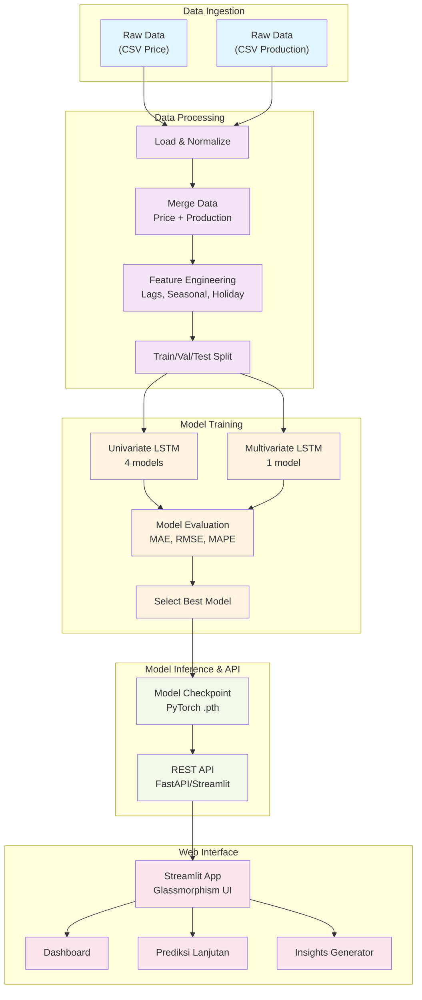

# Arsitektur Project Prediksi Harga Komoditas Pertanian

## Daftar Isi
1. [Ringkasan Proyek](#ringkasan-proyek)
2. [Arsitektur Tingkat Tinggi](#arsitektur-tingkat-tinggi)
3. [Data Flow](#data-flow)
4. [Struktur Folder Project](#struktur-folder-project)
5. [Technology Stack](#technology-stack)

---

## Ringkasan Proyek

**Nama Project**: Sistem Prediksi Harga Komoditas Pertanian Kabupaten Sumbawa  
**Tujuan**: Memprediksi harga komoditas pertanian utama (Beras, Jagung, Kacang Hijau) menggunakan model LSTM neural network untuk mendukung pengambilan keputusan bisnis jangka pendek dan panjang.

**Komoditas yang Diprediksi**:
- Beras Premium
- Beras Medium
- Jagung Pipil Kering
- Kacang Hijau

**Horizon Prediksi**: 1 hari hingga 365 hari (1 tahun)

---

## Arsitektur Tingkat Tinggi



---

## Data Flow

### 1. **Data Ingestion & Loading**
```
Raw Data (CSV)
    ↓
Load dari data/raw/
    ↓
Normalize column names
    ↓
Safe numeric conversion (handle StringDtype)
    ↓
Data siap untuk processing
```

### 2. **Data Processing & Feature Engineering**
```
Price Data + Production Data
    ↓
Merge berdasarkan Komoditi & Quarter
    ↓
Feature Engineering:
  - Lags (lag_1, lag_7, lag_14)
  - Seasonal (season_sin, season_cos)
  - Holiday flags
  - Day of year
    ↓
Split ke Train/Val/Test (70%-15%-15%)
    ↓
StandardScaler normalization
    ↓
Dataset siap training
```

### 3. **Model Training**
```
Dataset
    ↓
├─ Univariate (Temporal features only)
│   ├─ Beras Premium LSTM
│   ├─ Beras Medium LSTM
│   ├─ Jagung Pipil Kering LSTM
│   └─ Kacang Hijau LSTM
│
└─ Multivariate (Temporal + Exogenous features)
    └─ Combined Model LSTM

    ↓
RAPIDS CUDA Acceleration
    ↓
Model Checkpoint (.pth)
    ↓
Best Model Selection by MAE
```

### 4. **Prediction Pipeline**
```
Request dari Web App
    ↓
Load Commodity Data
    ↓
Load Best Model Checkpoint
    ↓
Feature Matrix Construction
    ↓
Iterative Multi-step Forecasting
    ↓
Adaptive Confidence Intervals
    ↓
Visualization & Insights
    ↓
JSON Response ke Frontend
```

---

## Struktur Folder Project

```
dsproject_agriculturepredict/
│
├── README.md                              # Project overview
├── config.yaml                            # Configuration (commodities, hyperparameters)
├── requirements.txt                       # Python dependencies
├── environment-local.yml                  # Conda environment YAML
│
├── data/
│   ├── raw/
│   │   ├── DATASET HARGA KOMODITI.csv    # Historical price data
│   │   └── produksi.csv                  # Production/productivity data
│   │
│   ├── processed/
│   │   ├── price_cleaned.csv             # Cleaned price data
│   │   └── production_transformed.csv    # Transformed production data
│   │
│   └── external/                         # External data sources (if any)
│
├── models/
│   ├── lstm_Beras_Premium_univariate.pth
│   ├── lstm_Beras_Premium_multivariate.pth
│   ├── lstm_Beras_Medium_univariate.pth
│   ├── lstm_Beras_Medium_multivariate.pth
│   ├── lstm_Jagung_Pipil_Kering_univariate.pth
│   ├── lstm_Jagung_Pipil_Kering_multivariate.pth
│   ├── lstm_Kacang_Hijau_univariate.pth
│   ├── lstm_Kacang_Hijau_multivariate.pth
│   │
│   └── best/                             # Best performing models
│       ├── Beras_Premium_multivariate_mae465.147.pth
│       ├── Beras_Premium_univariate_mae183.995.pth
│       ├── Beras_Medium_multivariate_mae44.176.pth
│       ├── Beras_Medium_univariate_mae70.425.pth
│       ├── Jagung_Pipil_Kering_multivariate_mae*.pth
│       ├── Jagung_Pipil_Kering_univariate_mae*.pth
│       ├── Kacang_Hijau_multivariate_mae*.pth
│       ├── Kacang_Hijau_univariate_mae*.pth
│       └── selected_models.csv           # Summary of best models
│
├── src/
│   ├── train.py                          # Main training script
│   ├── data/
│   │   ├── __init__.py
│   │   └── loader.py                     # Data loading utilities
│   │
│   ├── features/
│   │   ├── __init__.py
│   │   └── engineering.py                # Feature engineering functions
│   │
│   ├── models/
│   │   ├── __init__.py
│   │   └── base_model.py                 # BaseLSTMModel class definition
│   │
│   └── utils/
│       ├── __init__.py
│       └── helpers.py                    # Utility functions
│
├── streamlit_app/
│   ├── app.py                            # Main Streamlit entry point
│   ├── assets/
│   │   └── css/
│   │       └── glassmorphism.css         # Glassmorphism styling
│   │
│   ├── pages/
│   │   ├── 1_Dashboard.py               # Dashboard page
│   │   ├── 2_Prediksi_Lanjutan.py       # Advanced prediction page
│   │   └── 2_Info.py                    # Info page
│   │
│   └── utils/
│       ├── __init__.py
│       ├── data_processor.py             # Data preparation & forecasting
│       ├── model_loader.py               # Model loading utilities
│       ├── visualization.py              # Chart building functions
│       ├── insights_generator.py         # Insights generation
│       └── modelscaler/                  # Saved scalers for inference
│
├── notebooks/
│   ├── 01_Business_Understanding.ipynb
│   ├── 02_Data_Understanding.ipynb
│   ├── 03_Data_Preparation.ipynb
│   ├── 04_Exploratory_Data_Analysis.ipynb
│   ├── 05_Modeling_v2.ipynb
│   ├── 06_Evaluation.ipynb
│   └── 07_Deployment.ipynb
│
├── runs/                                 # Training outputs & metrics
│   ├── metrics_*.csv
│   ├── recomputed_compare.csv
│   ├── optuna_metrics.csv
│   └── [commodity_name]/
│       └── [mode]/
│           └── *.pth
│
├── scripts/
│   └── run_univariate_parallel.py       # Parallel training script
│
├── tests/                                # Unit tests (if any)
│   └── test_*.py
│
└── docs/
    ├── 01_Architecture.md               # This file
    ├── 02_Data_Dictionary.md
    ├── 03_Model.md
    ├── 04_Results.md
    ├── 05_Setup.md
    ├── 06_Usage.md
    └── Streamlit_Deployment_Guide.md
```

---

## Technology Stack

### **Backend & ML**
| Teknologi | Versi | Fungsi |
|-----------|-------|--------|
| Python | 3.10+ | Core programming language |
| PyTorch | 2.0+ | Deep learning framework |
| RAPIDS cuDF | 24.10 | GPU-accelerated dataframe processing |
| CUDA Toolkit | 11.8+ | GPU compute support |
| NumPy | 1.24+ | Numerical computing |
| Pandas | 2.0+ | Data manipulation |
| Scikit-learn | 1.3+ | Data preprocessing & metrics |

### **Web Framework**
| Teknologi | Versi | Fungsi |
|-----------|-------|--------|
| Streamlit | 1.28+ | Web app framework |
| Plotly | 5.17+ | Interactive visualization |

### **Development & Deployment**
| Teknologi | Versi | Fungsi |
|-----------|-------|--------|
| Conda | Latest | Environment management |
| Git | Latest | Version control |
| Docker | Latest | Containerization (optional) |
| Streamlit Cloud | - | Web deployment |

### **Hardware Requirements**
- **GPU**: NVIDIA GPU dengan CUDA Compute Capability 6.0+ (untuk RAPIDS)
- **RAM**: Minimum 8GB (recommended 16GB+)
- **Storage**: Minimum 10GB (untuk models, data, dan outputs)
- **CPU**: Multi-core recommended untuk parallel processing

---

## Komponen Utama

### 1. **Data Processing Pipeline** (`streamlit_app/utils/data_processor.py`)
- CSV loading dengan error handling
- Safe numeric conversion (menangani StringDtype)
- Merge price & production data
- Feature engineering (lags, seasonal, holiday)
- Time series split ke train/val/test
- StandardScaler normalization
- Adaptive confidence interval calculation

### 2. **Model Training** (`src/train.py`)
- Training loop dengan early stopping
- Multi-GPU support via RAPIDS
- Hyperparameter tuning (Optuna)
- Model evaluation & checkpoint saving
- Metric logging (MAE, RMSE, MAPE, sMAPE)

### 3. **Model Inference** (`streamlit_app/utils/model_loader.py`)
- Model checkpoint loading
- Device-aware inference (CPU/GPU)
- Batch prediction support
- Scaler restoration untuk normalization inversion

### 4. **Web Interface** (`streamlit_app/`)
- Dashboard halaman (quick view)
- Advanced prediction halaman (detailed analysis)
- Real-time visualization dengan Plotly
- Interactive model comparison
- Insights generator untuk bisnis insights

---

## Keamanan & Best Practices

✅ **Data Handling**
- StringDtype safety checks
- NaN handling dengan ffill & fillna
- Type conversion safety dengan astype

✅ **Model Management**
- Checkpoint versioning dengan MAE score
- Best model selection criteria
- Model device compatibility checks

✅ **Performance**
- RAPIDS GPU acceleration untuk data processing
- PyTorch GPU inference untuk prediction
- Caching di Streamlit untuk efisiensi

✅ **Error Handling**
- Try-catch blocks di critical sections
- User-friendly error messages
- Graceful fallbacks untuk edge cases

---

## Monitoring & Logging

Project menggunakan logging untuk:
- Training progress tracking
- Model performance metrics
- Prediction latency monitoring
- Error debugging

Logs tersimpan di folder `runs/` dengan format CSV untuk mudah dianalisis.

---

**Document Version**: 1.0  
**Last Updated**: June 2026  
**Maintained By**: Data Science Team
